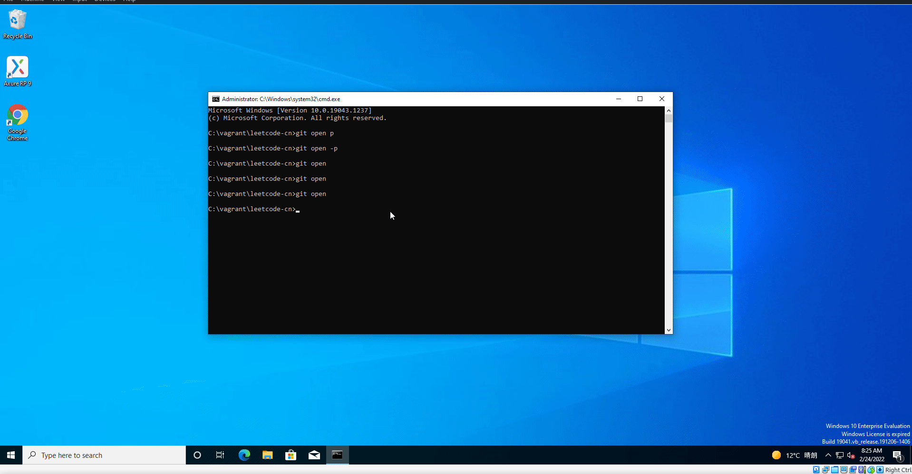

# git-open
快速通过浏览器访问当前仓库地址
```bash
Usage of ./git-open:
  -p    open github action page or gitlab pipeline page
  -v    show program version
```

# Download
[download](https://github.com/hellojukay/git-open/releases)
# Install
```bash
go install github.com/hellojukay/git-open@latest
```
